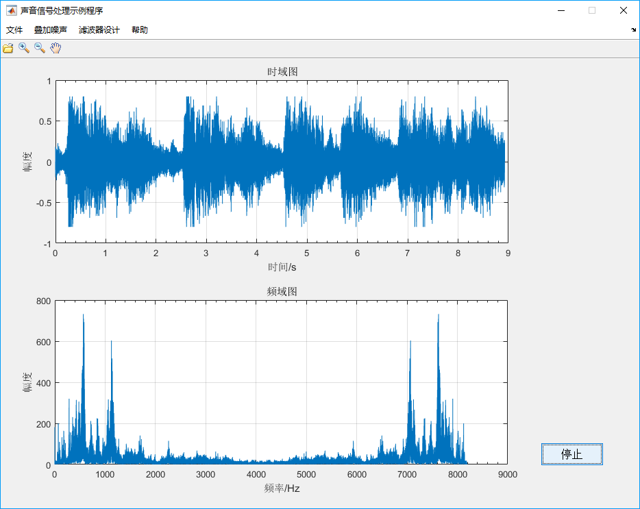

# 声音处理示例程序说明文档

### 题目：数字滤波器设计及其在语音信号分析中的应用
#### **设计要求：** 

1. 录制采集一段自己的语音信号。

2. 应用matlab平台给语音信号叠加噪声，噪声类型可以是:(1)白噪声（2）单频噪声（3）多频噪声或者其它噪声，画出时域和频域图形，并给出听觉上的比较。

3. 设计数字滤波器，分别给出FIR滤波器和IIR滤波器的设计，进行滤波，比较效果并给出分析。

4. 设计系统界面，要求能够输入滤波参数，查看设计结果和滤波结果。

 

## 系统界面

 

## 注意事项
- 本程序为完成课程设计作业，也可做简单的声音数字处理验证性实验

- 在Matlab 2013a 与 Matlab 2014b 测试通过

- 可处理的声音文件只限于WAV和MP3格式文件

- 请将Matlab当前路径指定于DSP_export.m所在目录

- 执行DSP_export.m即可

- IIR滤波器采用的是巴普沃斯滤波器设计

- FIR滤波器采用的是汉明窗设计

- DSP.m与DSP.fig为设计时用到的文件

- DSP _export.m 与 DSP _export.fig为导出的文件没有fig文件

 

## 滤波器函数说明
### **IIR滤波器实现函数** 

    function resdata = IIR_filter(wp,ws,rp,rs,data,Fs)
    Wp = 0.20*2*pi;Ws=0.25*2*pi;Rp=1;Rs=15;%数字性能指标
    %Wp=wp*pi;Ws=ws*pi;Rp=rp;Rs=rs;%数字性能指标
    Ts = 1/Fs;
    Wp1 = (2/Ts)*tan(Wp/2);   %将数字指标转换成模拟指标
    Ws1 = (2/Ts)*tan(Ws/2);
    [N,Wn]  = buttord(Wp1,Ws1,Rp,Rs,'s');  %N滤波器的最小阶数，Wn截止频率
    [Z,P,K] = buttap(N);  %求模拟滤波器的系统函数，零极点和增益形式
    [Bap,Aap] = zp2tf(Z,P,K); %变为多项式形式
    [b,a] = lp2lp(Bap,Aap,Wn);%去归一化
    [bz,az] = bilinear(b,a,Fs);   %双线性变换法实现AF到DF的转换
    figure('NumberTitle', 'off', 'Name', 'IIR数字滤波器设计结果','menubar','none');
    freqz(bz,az,Fs); %滤波器的频率响应
    resdata=filter(bz,az,data);%数字滤波
 
### **FIR滤波器实现函数** 

    %选海明窗
    function resdata = FIR_filter(wp,ws,rp,rs,data,Fs)
    Wp=wp*1000*2/Fs;% 频率归一化
    Ws=ws*1000*2/Fs;
    wdel=Ws-Wp;% 过渡带宽
    wn=0.5*(wp+ws);% 近似计算截止频率
    N=ceil(6.6*pi/wdel);% 根据过渡带宽度求滤波器阶数
    window=hamming(N+1);% 海明窗
    b=fir1(N,wn,window);% FIR滤波器设计
    figure('NumberTitle', 'off', 'Name', 'FIR数字滤波器设计结果','menubar','none');
    freqz(b,1,512);% 查看滤波器幅频及相频特性
    resdata = filter(b,1,data);%对信号data进行滤波

 

## 最后
初次用Matlab编写数字信号处理程序，难免存在BUG，请谅解。 
真心的欢迎每一位学习与开发者参与测试、修改与传播。让更多的人感受数字信号的魅力，谢谢。
